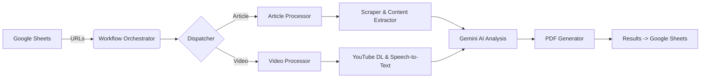

# Jay Rosen Digital Archive (JRDA)

[](https://github.com/jamditis/rosen-frontend/actions/workflows/frontend-validation.yml)
[](https://github.com/jamditis/rosen-frontend/actions/workflows/backend-tests.yml)

**Status: Ready for Publication (December 2025)**

A comprehensive digital archive project for NYU Professor Jay Rosen's work, including an interactive frontend application, a Python-based data pipeline for content processing, and supporting tools for analysis and visualization.

This archive includes the public release of Jay Rosen's 1986 doctoral dissertation, *The Impossible Press: American Journalism and the Decline of Public Life*, with 9 interactive presentation tools for exploring the dissertation and its contemporary relevance.


## 📦 Repository Structure

This monorepo contains:

| Directory | Description |
|-----------|-------------|
| **`/frontend`** | Zero-build React application (React, HTM, Tailwind via CDN) |
| **`/features`** | Standalone feature tools (comparison-tool, glossary, timeline, etc.) |
| **`/labs`** | Experimental features (dissertation launch site, 3D concept sphere) |
| **`/data`** | Archive data files (CSV sources, generated JSON) |
| **`/backend`** | Python data pipeline for scraping, AI analysis, and archiving |
| **`/dissertation`** | Full dissertation PDFs (stored via Git LFS) and transcribed markdown |
| **`/tools`** | Development tools (dataexplorer, dataviz) and RStudio analysis scripts |
| **`/archived`** | Legacy code and archived features for reference |
| **`/docs`** | Documentation, agent personas, and project narrative |
| **`/release-assets`** | Promotional materials and release documentation |

---

## 🌐 Frontend Application

### 🏗️ Zero-Build Architecture

The frontend uses a **zero-build static architecture** designed for simple deployment to any web host via FTP—including WordPress subdirectories.

**Tech Stack:**
*   **Files:** `*.js` (ES Modules), `*.html`, `*.css`
*   **Stack:** React (via CDN), `htm` (for JSX-like syntax in plain JS), Tailwind CSS (via CDN)
*   **Dependencies:** All loaded via `esm.sh` CDN—no `node_modules` required

**Why Zero-Build?**
*   No build step required. Simply upload files and it works.
*   WordPress compatible. Can be deployed to any WordPress domain by uploading to a subdirectory.
*   Universal hosting. Works on any static web host.

### 🌟 Key Features

#### 🗂️ Browsing & Discovery
*   **Smart Filtering:** Filter records by Era, Media Type, Publication, and Thematic Categories
*   **Full-Text Search:** Instant search across titles, summaries, and concepts
*   **Interactive Timeline:** Dynamic bar-chart visualization to filter records by year

#### 🕸️ The Explorer (Network Visualization)
*   **Interactive Graph:** Canvas-based visualization mapping relationships between articles
*   **Manhattan Routing:** Aesthetic connection paths inspired by subway maps
*   **Export Capabilities:** Generate and download high-resolution PNG cards

#### 📜 Dissertation Presentation Tools (8 in `/features/`)
*   **"Then and Now" Comparison Tool:** 7 side-by-side 1986 vs 2025 comparisons (`/features/comparison-tool/`)
*   **Glossary:** 16 key concepts with definitions and contemporary relevance (`/features/glossary/`)
*   **1986 in Journalism:** Historical context—the media landscape when the dissertation was written (`/features/context-1986/`)
*   **Timeline:** 14 entries tracking intellectual evolution from 1986 to 2025 (`/features/timeline/`)
*   **Annotated Excerpts:** 12 key passages with 2025 commentary (`/features/annotated-excerpts/`)
*   **FAQ / Ask the Dissertation:** 46 Q&A pairs, searchable, with NotebookLM integration (`/features/faq/`)
*   **Dissertation Reader:** Full text reader with selection sharing and quote image generation (`/features/dissertation-reader/`)
*   **Network Effect:** Entity relationship visualization for the archive (`/features/network-effect/`)

#### 🚀 Dissertation Launch Site (`/labs/dissertation-launch/`)
*   **Landing Page:** Hero section, navigation grid, about section
*   **3D Concept Sphere:** Three.js force-directed graph with 45+ concepts

#### 🧭 Main Archive Components
*   **Interactive Mind Map:** Left-to-right tree visualization with auto-fit zooming and keyboard navigation
*   **Network Explorer:** Canvas-based visualization of relationships between archive records

#### ♿ Accessibility
*   **Keyboard Navigation:** Full keyboard support (arrow keys, +/-, ESC)
*   **Screen Reader Support:** ARIA labels, roles, and live regions
*   **Touch Support:** Mobile-optimized touch targets (44px+)
*   **Responsive Design:** Works across mobile, tablet, and desktop

---

## 🐍 Backend Data Pipeline

Located in `/backend`, the Python pipeline automatically fetches, processes, and archives digital content.

### Features
- **Multi-Source Scraping:** Web articles, YouTube videos, audio content
- **AI Analysis:** Google Gemini API for categorization and summarization
- **PDF Archiving:** Generates formatted PDF archives
- **Data Management:** Google Sheets integration for storage and tracking

### Architecture


### Setup

**Requirements:** Python 3.10 or higher

```bash
cd backend
python -m venv venv
source venv/bin/activate
pip install poetry
poetry install
playwright install
```

### Configuration
Copy `backend/.env.example` to `backend/.env` and fill in your values:
```bash
cp backend/.env.example backend/.env
```

Edit `backend/.env`:
```
SPREADSHEET_NAME="Your Google Sheet Name"
GEMINI_API_KEY="your_gemini_api_key"
```

Place Google Cloud service account credentials in `backend/google_credentials.json`.

### Usage
```bash
cd backend
python src/workflow.py              # Run main pipeline
python tools/diagnostics/data_deduper.py    # Clean data
python tools/backfill/backfill_worker.py    # Fill missing fields
```

---

## 🚀 Quick Start

### Frontend (Local Development)
```bash
# Clone the repository (Git LFS required for dissertation PDFs)
git lfs install
git clone https://github.com/jamditis/rosen-frontend.git
cd rosen-frontend

# (Optional) Regenerate JSON data from CSV sources
npm install
npm run export-data

# Start a static server
python -m http.server 8000

# Open http://localhost:8000
```

> **Note:** This repository uses [Git LFS](https://git-lfs.github.com/) to manage large dissertation PDF files (~135 MB). Install Git LFS before cloning to automatically download the PDF files.

### Backend (Data Pipeline)
```bash
cd backend
python -m venv venv && source venv/bin/activate
poetry install
playwright install
python src/workflow.py
```

---

## 📂 Full Project Structure

```text
├── index.html                   # Main entry point
├── shared-styles.css            # Common CSS for standalone tools
│
├── frontend/                    # Main React application
│   ├── App.js                   # Main frontend controller
│   ├── index.js                 # React root mount
│   ├── constants.js             # Configuration
│   ├── components/              # React components
│   │   ├── Explorer.js          # Network visualization
│   │   ├── MindMap.js           # Dissertation mind map
│   │   ├── DetailPanel.js       # Dissertation node details
│   │   ├── dissertationData.js  # Full dissertation content
│   │   └── ...
│   └── services/
│       └── archiveService.js    # Data fetching & caching
│
├── features/                    # Standalone feature tools
│   ├── comparison-tool/         # "Then and Now" comparisons
│   ├── glossary/                # Interactive concept glossary
│   ├── context-1986/            # Historical context
│   ├── timeline/                # Intellectual evolution timeline
│   ├── annotated-excerpts/      # Key passages with commentary
│   ├── faq/                     # FAQ (Ask the Dissertation)
│   ├── dissertation-reader/     # Full text reader with sharing
│   └── network-effect/          # Entity relationship visualization
│
├── labs/                        # Experimental features
│   └── dissertation-launch/     # Dissertation launch site
│       ├── landing-page/        # Main landing page
│       └── 3d-concepts/         # 3D concept sphere (Three.js)
│
├── data/                        # Archive data files
│   ├── archive-data.json        # Generated JSON for frontend
│   ├── archive_records-public.csv
│   ├── social_posts.csv
│   ├── extracted_entities.csv
│   └── extracted_relationships.csv
│
├── backend/                     # Python data pipeline
│   ├── src/                     # Core source code
│   ├── scripts/                 # Utility scripts
│   ├── tests/                   # Test suite
│   ├── pyproject.toml           # Poetry dependencies
│   └── schema.json              # Data schema
│
├── dissertation/                # Dissertation files
│   ├── *.pdf                    # Original PDF scans
│   └── *.md                     # Transcribed markdown
│
├── tools/                       # Development & analysis tools
│   ├── active/                  # Active tools (dataexplorer, dataviz)
│   └── analysis/
│       ├── RStudio/             # R analysis scripts and visualizations
│       └── planning/            # Project planning docs
│
├── archived/                    # Legacy and archived code
│   ├── archive-v1/              # Original archive version
│   ├── web/                     # Promotional website
│   └── byok-chat/               # Archived BYOK chat feature
│
├── docs/                        # Documentation
│   ├── agent-personas/          # AI persona definitions
│   └── narrative/               # Project logs
│
├── release-assets/              # Promotional materials
│   └── documentation/           # Pre-publication reports
│
├── .github/                     # GitHub configuration
│   ├── workflows/               # CI/CD pipelines
│   ├── ISSUE_TEMPLATE/          # Issue templates
│   └── PULL_REQUEST_TEMPLATE.md # PR template
│
├── CLAUDE.md                    # AI assistant instructions
├── SECURITY.md                  # Security policy
├── CODE_OF_CONDUCT.md           # Community standards
└── CONTRIBUTING.md              # Contribution guidelines
```

---

## 📊 Data Management

### Data Architecture

The frontend loads pre-processed static JSON rather than fetching from Google Sheets at runtime:

```
Google Sheets (curation) → CSV exports → JSON generation → Static deployment
```

**Workflow:**
1. **Curate** content in Google Sheets
2. **Export** CSV files to `/data/` directory
3. **Generate** JSON: `npm run export-data`
4. **Deploy** `archive-data.json` to WordPress via FTP

**Performance:** ~100-200ms load time (vs. 800-1500ms from Google Sheets API)

### Data Files

| File | Description |
|------|-------------|
| `archive_records-public.csv` | Main archive records |
| `social_posts.csv` | Bluesky and Twitter posts |
| `extracted_entities.csv` | Named entities (~5k) |
| `extracted_relationships.csv` | Entity relationships |
| `archive-data.json` | Generated file for frontend (~25MB) |

### Record Schema

| Column Header | Description |
|---------------|-------------|
| `ID` | Unique identifier (e.g., `art-001`) |
| `Title` | Title of the work |
| `Author` | Author name (defaults to Jay Rosen) |
| `Publication_Date` | Format: `YYYY-MM-DD` |
| `Original_Publication` | Publisher name |
| `URL` | Link to source material |
| `Summary` | Brief description |
| `Thematic_Categories` | Comma-separated categories |
| `Key_Concepts` | Comma-separated concepts |
| `Verified` | `TRUE` or `FALSE` |

---

## 🔄 CI/CD & Automated Testing

The repository includes GitHub Actions workflows for continuous integration:

### Backend Workflows
- **`backend-tests.yml`** - Runs pytest on all backend code changes
  - Triggers on push/PR to `main` when backend files change
  - Uses Python 3.13 and Poetry
  - Installs Playwright for browser-based tests
  - Caches dependencies for faster runs

- **`backend-linting.yml`** - Runs code quality checks
  - `ruff` for linting
  - `black` for formatting validation
  - `mypy` for type checking
  - Non-blocking to avoid breaking builds during adoption

### Frontend Workflow
- **`frontend-validation.yml`** - Basic smoke tests
  - Validates HTML syntax
  - Checks JavaScript for syntax errors
  - Verifies main entry points exist
  - Checks for broken CDN links

All workflows run automatically on pull requests to ensure code quality.

---

## 🛠️ Deployment

### Frontend (Static Hosting)
1. Generate fresh data: `npm run export-data`
2. Upload `index.html`, `shared-styles.css`, and `favicon.ico` from root
3. Upload entire `frontend/` directory
4. Upload entire `features/` directory
5. Upload entire `labs/` directory
6. Upload `data/archive-data.json` to `/wp-content/rosen-archive/data/`
7. For WordPress: upload to `/wp-content/rosen-archive/` via FTP
8. Ensure server serves `.js` with MIME type `application/javascript`

### Backend (Server)
1. Set up Python 3.10+ environment with Poetry
2. Configure environment variables and credentials
3. Run as scheduled job or on-demand

---

## 📜 License

This project is licensed under the MIT License - see the [LICENSE](LICENSE) file for details.

---

**Curated by Joe Amditis.**
