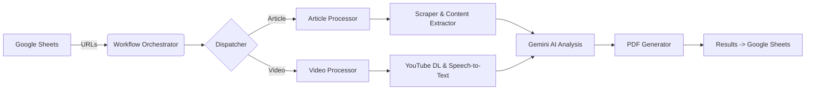

# Jay Rosen Digital Archive (JRDA)

A comprehensive digital archive project for NYU Professor Jay Rosen's work, including an interactive frontend application, a Python-based data pipeline for content processing, and supporting tools for analysis and visualization.


## 📦 Repository Structure

This monorepo contains:

| Directory | Description |
|-----------|-------------|
| **Root** (`/`) | Zero-build frontend application (React, HTM, Tailwind via CDN) |
| **`/backend`** | Python data pipeline for scraping, AI analysis, and archiving |
| **`/dissertation`** | Full dissertation PDFs (stored via Git LFS) and transcribed markdown |
| **`/data-tools`** | R scripts and planning documents for data analysis |
| **`/docs`** | Documentation, agent personas, and project narrative |
| **`/tools`** | Additional presentation tools (dataexplorer, dataviz, dissertation-reader, etc.) |
| **`/release-assets`** | Promotional materials and release documentation |

---

## 🌐 Frontend Application

### 🏗️ Zero-Build Architecture

The frontend uses a **zero-build static architecture** designed for simple deployment to any web host via FTP—including WordPress subdirectories.

**Tech Stack:**
*   **Files:** `*.js` (ES Modules), `*.html`, `*.css`
*   **Stack:** React (via CDN), `htm` (for JSX-like syntax in plain JS), Tailwind CSS (via CDN)
*   **Dependencies:** All loaded via `esm.sh` CDN—no `node_modules` required

**Why Zero-Build?**
*   No build step required. Simply upload files and it works.
*   WordPress compatible. Can be deployed to any WordPress domain by uploading to a subdirectory.
*   Universal hosting. Works on any static web host.

### 🌟 Key Features

#### 🗂️ Browsing & Discovery
*   **Smart Filtering:** Filter records by Era, Media Type, Publication, and Thematic Categories
*   **Full-Text Search:** Instant search across titles, summaries, and concepts
*   **Interactive Timeline:** Dynamic bar-chart visualization to filter records by year

#### 🕸️ The Explorer (Network Visualization)
*   **Interactive Graph:** Canvas-based visualization mapping relationships between articles
*   **Manhattan Routing:** Aesthetic connection paths inspired by subway maps
*   **Export Capabilities:** Generate and download high-resolution PNG cards

#### 📜 Dissertation Presentation Tools
*   **Interactive Mind Map:** Left-to-right tree visualization with auto-fit zooming, keyboard navigation, and touch support
*   **"Then and Now" Comparison Tool:** 1986 insights alongside 2025 realities (`/comparison-tool/`)
*   **Glossary:** Interactive concept glossary with definitions (`/glossary/`)
*   **1986 in Journalism:** Historical context page (`/context-1986/`)
*   **Timeline:** Visual timeline of intellectual evolution (`/timeline/`)
*   **Annotated Excerpts:** Key passages with commentary (`/annotated-excerpts/`)
*   **FAQ / Ask the Dissertation:** 46 Q&A pairs, searchable (`/faq/`)

#### ♿ Accessibility
*   **Keyboard Navigation:** Full keyboard support (arrow keys, +/-, ESC)
*   **Screen Reader Support:** ARIA labels, roles, and live regions
*   **Touch Support:** Mobile-optimized touch targets (44px+)
*   **Responsive Design:** Works across mobile, tablet, and desktop

---

## 🐍 Backend Data Pipeline

Located in `/backend`, the Python pipeline automatically fetches, processes, and archives digital content.

### Features
- **Multi-Source Scraping:** Web articles, YouTube videos, audio content
- **AI Analysis:** Google Gemini API for categorization and summarization
- **PDF Archiving:** Generates formatted PDF archives
- **Data Management:** Google Sheets integration for storage and tracking

### Architecture


### Setup

**Requirements:** Python 3.10 or higher

```bash
cd backend
python -m venv venv
source venv/bin/activate
pip install poetry
poetry install
playwright install
```

### Configuration
Copy `backend/.env.example` to `backend/.env` and fill in your values:
```bash
cp backend/.env.example backend/.env
```

Edit `backend/.env`:
```
SPREADSHEET_NAME="Your Google Sheet Name"
GEMINI_API_KEY="your_gemini_api_key"
```

Place Google Cloud service account credentials in `backend/google_credentials.json`.

### Usage
```bash
cd backend
python src/workflow.py              # Run main pipeline
python tools/diagnostics/data_deduper.py    # Clean data
python tools/backfill/backfill_worker.py    # Fill missing fields
```

---

## 🚀 Quick Start

### Frontend (Local Development)
```bash
# Clone the repository (Git LFS required for dissertation PDFs)
git lfs install
git clone https://github.com/jamditis/rosen-frontend.git
cd rosen-frontend

# Start a static server
python -m http.server 8000

# Open http://localhost:8000
```

> **Note:** This repository uses [Git LFS](https://git-lfs.github.com/) to manage large dissertation PDF files (~135 MB). Install Git LFS before cloning to automatically download the PDF files.

### Backend (Data Pipeline)
```bash
cd backend
python -m venv venv && source venv/bin/activate
poetry install
playwright install
python src/workflow.py
```

---

## 📂 Full Project Structure

```text
├── components/                  # Frontend React components
│   ├── Explorer.js              # Network visualization
│   ├── MindMap.js               # Dissertation mind map
│   ├── DetailPanel.js           # Dissertation node details
│   ├── dissertationData.js      # Full dissertation content
│   └── ...
├── services/
│   └── archiveService.js        # Data fetching & caching
├── comparison-tool/             # "Then and Now" comparisons
├── glossary/                    # Interactive concept glossary
├── context-1986/                # Historical context
├── timeline/                    # Intellectual evolution timeline
├── annotated-excerpts/          # Key passages with commentary
├── faq/                         # FAQ (Ask the Dissertation)
├── future-features/             # Archived features for future use
│
├── backend/                     # Python data pipeline
│   ├── src/                     # Core source code
│   ├── scripts/                 # Utility scripts
│   ├── tests/                   # Test suite
│   ├── pyproject.toml           # Poetry dependencies
│   └── schema.json              # Data schema
│
├── dissertation/                # Dissertation files
│   ├── *.pdf                    # Original PDF scans
│   └── *.md                     # Transcribed markdown
│
├── data-tools/                  # Analysis tools
│   ├── RStudio/                 # R scripts
│   └── planning/                # Project planning docs
│
├── docs/                        # Documentation
│   ├── agent-personas/          # AI persona definitions
│   └── narrative/               # Project logs
│
├── tools/                       # Additional presentation tools
│   ├── dataexplorer/            # Data explorer grid
│   ├── dataviz/                 # Data visualization tool
│   ├── dissertation-reader/     # Dissertation reader app
│   ├── archive-v1/              # Original archive version (reference)
│   └── web/                     # Promotional website
│
├── release-assets/              # Promotional materials
├── App.js                       # Main frontend controller
├── constants.js                 # Configuration
├── index.html                   # Frontend entry point
└── CLAUDE.md                    # AI assistant instructions
```

---

## 📊 Data Management

The frontend content is populated via CSV exports from Google Sheets.

| Column Header | Description |
|---------------|-------------|
| `ID` | Unique identifier (e.g., `art-001`) |
| `Title` | Title of the work |
| `Author` | Author name (defaults to Jay Rosen) |
| `Publication_Date` | Format: `YYYY-MM-DD` |
| `Original_Publication` | Publisher name |
| `URL` | Link to source material |
| `Summary` | Brief description |
| `Thematic_Categories` | Comma-separated categories |
| `Key_Concepts` | Comma-separated concepts |
| `Verified` | `TRUE` or `FALSE` |

---

## 🔄 CI/CD & Automated Testing

The repository includes GitHub Actions workflows for continuous integration:

### Backend Workflows
- **`backend-tests.yml`** - Runs pytest on all backend code changes
  - Triggers on push/PR to `main` when backend files change
  - Uses Python 3.13 and Poetry
  - Installs Playwright for browser-based tests
  - Caches dependencies for faster runs

- **`backend-linting.yml`** - Runs code quality checks
  - `ruff` for linting
  - `black` for formatting validation
  - `mypy` for type checking
  - Non-blocking to avoid breaking builds during adoption

### Frontend Workflow
- **`frontend-validation.yml`** - Basic smoke tests
  - Validates HTML syntax
  - Checks JavaScript for syntax errors
  - Verifies main entry points exist
  - Checks for broken CDN links

All workflows run automatically on pull requests to ensure code quality.

---

## 🛠️ Deployment

### Frontend (Static Hosting)
1. Upload all `.html`, `.css`, `.js` files and the `components/`, `services/` folders
2. For WordPress: upload to a subdirectory via FTP
3. Ensure server serves `.js` with MIME type `application/javascript`

### Backend (Server)
1. Set up Python 3.10+ environment with Poetry
2. Configure environment variables and credentials
3. Run as scheduled job or on-demand

---

## 📜 License

This project is licensed under the MIT License - see the [LICENSE](LICENSE) file for details.

---

**Curated by Joe Amditis.**
