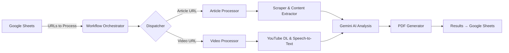

# Jay Rosen Digital Archive - Backend Pipeline

The backend is a Python-based data pipeline that automatically fetches, processes, archives, and analyzes digital content from Jay Rosen's work across the web. It uses AI-powered analysis (Google Gemini) to categorize, summarize, and extract key concepts from articles, videos, and other media.

---

## 🎯 What the Backend Does

The pipeline performs these core functions:

1. **Content Scraping** - Fetches articles, videos, and multimedia content from URLs
2. **AI Analysis** - Uses Google Gemini to categorize, summarize, and extract concepts
3. **PDF Archiving** - Generates formatted PDF archives of content
4. **Data Management** - Reads from and writes to Google Sheets for tracking
5. **Entity Resolution** - Identifies and resolves entities (people, organizations, publications)
6. **Batch Processing** - Handles backfills and bulk reprocessing operations

---

## 🏗️ Architecture Overview

### Pipeline Flow



### Core Components

| Component | File | Purpose |
|-----------|------|---------|
| **Workflow Orchestrator** | `src/rosen_scraper/workflow.py` | Main entry point, orchestrates the entire pipeline |
| **Dispatcher** | `src/rosen_scraper/dispatcher.py` | Routes URLs to appropriate processors |
| **Article Processor** | `src/rosen_scraper/processors/article_processor.py` | Handles web article processing |
| **Video Processor** | `src/rosen_scraper/processors/video_processor.py` | Handles YouTube video processing |
| **Scraper** | `src/rosen_scraper/scraper.py` | Extracts content using Trafilatura & Playwright |
| **Categorizer** | `src/rosen_scraper/categorizer.py` | AI-powered classification using Google Gemini |
| **PDF Generator** | `src/rosen_scraper/pdf_generator.py` | Creates formatted PDF archives |
| **Entity Resolver** | `src/rosen_scraper/entity_resolver.py` | Identifies and resolves entities |
| **Logger** | `src/rosen_scraper/logger.py` | Centralized logging with poison pill detection |

### Directory Structure

```
backend/
├── src/
│   └── rosen_scraper/          # Main package
│       ├── workflow.py          # Pipeline orchestrator
│       ├── dispatcher.py        # URL routing
│       ├── categorizer.py       # AI analysis
│       ├── scraper.py           # Content extraction
│       ├── pdf_generator.py     # PDF creation
│       ├── entity_resolver.py   # Entity management
│       ├── logger.py            # Logging system
│       └── processors/          # Content processors
│           ├── article_processor.py
│           ├── video_processor.py
│           └── audio_processor.py
├── scripts/                     # Utility scripts
│   ├── backfill/               # Historical data processing
│   ├── diagnostics/            # Analysis and debugging tools
│   ├── pdf/                    # PDF utilities
│   └── README.md               # Scripts documentation
├── tests/                       # Test suite
├── pyproject.toml              # Poetry dependencies
├── schema.json                 # Taxonomy and data schema
└── entity_extraction_schema.json  # Entity extraction rules
```

---

## 🚀 Quick Start

### Prerequisites

- **Python 3.13+** (specified in `pyproject.toml`)
- **Poetry** for dependency management
- **Google Cloud Platform Account** with:
  - Google Sheets API enabled
  - Gemini API access
  - Service account credentials
- **Playwright browsers** (installed via setup)

### Installation

```bash
# 1. Navigate to backend directory
cd backend

# 2. Create and activate virtual environment
python -m venv venv
source venv/bin/activate  # On Windows: venv\Scripts\activate

# 3. Install Poetry (if not already installed)
pip install poetry

# 4. Install dependencies
poetry install

# 5. Install Playwright browsers
playwright install
```

### Configuration

#### 1. Environment Variables

Create a `.env` file in the `backend/` directory:

```bash
# Google Sheets Configuration
SPREADSHEET_NAME="Your Google Sheet Name"

# AI Configuration
GEMINI_API_KEY="your_gemini_api_key_here"

# Optional: Logging Configuration
LOG_LEVEL="INFO"  # DEBUG, INFO, WARNING, ERROR, CRITICAL
```

#### 2. Google Cloud Credentials

Place your Google Cloud service account JSON file at:

```
backend/google_credentials.json
```

**Required permissions:**
- Google Sheets API read/write access
- Google Drive API access (for PDF storage)

#### 3. Google Sheets Setup

The pipeline expects two Google Sheets:

1. **Input Sheet** - Contains URLs to process with columns:
   - URL
   - Status (empty for new, "Processed" for completed)
   
2. **Output Sheet** - Stores processed results (created automatically)

---

## 📖 Usage

### Running the Main Pipeline

Process new URLs from the input sheet:

```bash
cd backend
python src/rosen_scraper/workflow.py
```

This will:
1. Read unprocessed URLs from Google Sheets
2. Dispatch each URL to the appropriate processor
3. Scrape and analyze content
4. Generate PDF archives
5. Write results back to Google Sheets

### Common Commands

```bash
# Run main pipeline
python src/rosen_scraper/workflow.py

# Clean duplicate data
python scripts/diagnostics/data_deduper.py

# Backfill missing metadata
python scripts/backfill/backfill_worker.py

# Backfill missing dates
python scripts/run_date_backfill.py

# Run entity extraction
python src/rosen_scraper/entity_extractor.py

# Run smart corrector (fix data issues)
python scripts/run_smart_corrector.py
```

### Running Tests

```bash
# Install dev dependencies
poetry install --with dev

# Run all tests
pytest

# Run with coverage
pytest --cov=src/rosen_scraper

# Run specific test file
pytest tests/test_logging_system.py
```

---

## 🔧 Configuration Files

### `schema.json`

Defines the taxonomy used by the AI for classification:

- **Thematic Categories** - 6 categories (Press & Media Criticism, etc.)
- **Key Concepts** - Jay Rosen's signature concepts ("View from Nowhere", etc.)
- **Eras** - 6 time periods (1990-Present)
- **Content Formats** - Blog Post, Article, Academic Paper, etc.
- **Output Headers** - Column structure for Google Sheets

### `entity_extraction_schema.json`

Defines rules for entity extraction:

- Person entities (journalists, academics, politicians)
- Organization entities (news outlets, institutions)
- Publication entities (books, papers)

### `pyproject.toml`

Poetry configuration with dependencies:

- **Content Processing:** `trafilatura`, `playwright`, `beautifulsoup4`
- **Google Services:** `gspread`, `google-api-python-client`, `google-generativeai`
- **Media Processing:** `yt-dlp` (YouTube), `google-cloud-speech` (transcription)
- **PDF Generation:** `reportlab`
- **Testing:** `pytest`, `pytest-mock`

---

## 🐛 Troubleshooting

### Common Issues

#### 1. Import Errors or Module Not Found

**Problem:** `ModuleNotFoundError: No module named 'rosen_scraper'`

**Solution:**
```bash
# Ensure you're in the backend directory and venv is activated
cd backend
source venv/bin/activate
poetry install
```

#### 2. Google Sheets Authentication Failures

**Problem:** `gspread.exceptions.APIError: [403] Forbidden`

**Solution:**
- Verify `google_credentials.json` is in the `backend/` directory
- Ensure service account has access to the target Google Sheet
- Share the sheet with the service account email (found in credentials JSON)

#### 3. Gemini API Errors

**Problem:** `google.api_core.exceptions.PermissionDenied: 403`

**Solution:**
- Verify `GEMINI_API_KEY` in `.env` is correct
- Check API key has Gemini API access enabled in Google Cloud Console
- Verify billing is enabled for the Google Cloud project

#### 4. Playwright Browser Errors

**Problem:** `playwright._impl._api_types.Error: Executable doesn't exist`

**Solution:**
```bash
playwright install
```

#### 5. PDF Generation Failures

**Problem:** PDFs not being created or saved

**Solution:**
- Check Google Drive API permissions
- Verify sufficient disk space
- Check logs for specific error messages

#### 6. Content Extraction Returns Empty Text

**Problem:** Scraped articles have no text content

**Solution:**
- Site may be JavaScript-heavy (Playwright should handle this)
- Site may require authentication (add to paywalled domains list)
- Site may be blocking automated access (check poison pill handler logs)

### Debug Mode

Enable detailed logging:

```bash
# Set in .env
LOG_LEVEL="DEBUG"

# Or set environment variable
export LOG_LEVEL="DEBUG"
python src/rosen_scraper/workflow.py
```

Logs are written to:
- Console (stdout)
- `logs/` directory (if configured)

### Poison Pill Detection

The pipeline includes automatic detection of failed scrapes (paywalls, blocks, etc.):

- Check logs for "POISON PILL DETECTED" messages
- Review `src/rosen_scraper/poison_pill_handler.py` for detection logic
- Known paywalled domains in `workflow.py`: Washington Post, NY Times, WSJ

---

## 🔬 Development Workflow

### Making Changes

1. **Create a feature branch**
   ```bash
   git checkout -b feature/my-feature
   ```

2. **Make code changes** in `src/rosen_scraper/`

3. **Run tests**
   ```bash
   pytest
   ```

4. **Test manually**
   ```bash
   python src/rosen_scraper/workflow.py
   ```

5. **Commit and push**
   ```bash
   git add .
   git commit -m "Description of changes"
   git push origin feature/my-feature
   ```

### Adding New Dependencies

```bash
# Add runtime dependency
poetry add package-name

# Add dev dependency
poetry add --group dev package-name

# Update lock file
poetry lock

# Install updated dependencies
poetry install
```

### Adding New Processors

To add a new content type processor:

1. Create processor in `src/rosen_scraper/processors/new_processor.py`
2. Implement `process_<type>(url, schema)` function
3. Add URL pattern detection in `dispatcher.py`
4. Add tests in `tests/test_new_processor.py`

### Modifying Taxonomy

To add categories, concepts, or eras:

1. Edit `schema.json`
2. Update the `taxonomy` section
3. Test AI classification with new values
4. Update documentation if needed

---

## 📊 Data Schema

The pipeline outputs structured data with these key fields:

| Field | Description |
|-------|-------------|
| `id` | Auto-generated unique identifier |
| `title` | Article/content title |
| `url` | Source URL |
| `author` | Author name (defaults to Jay Rosen) |
| `publication_date` | Publication date (YYYY-MM-DD) |
| `original_publication` | Publisher name |
| `summary` | AI-generated summary |
| `thematic_categories` | List of category tags |
| `key_concepts` | List of Rosen's signature concepts |
| `era` | Time period classification |
| `scope` | Type of analysis (Theoretical, Commentary, etc.) |
| `raw_text` | Full extracted text |
| `gdrive_pdf_link` | Link to archived PDF |
| `verified` | Manual verification status |

See `schema.json` for the complete list of output headers.

---

## 🤝 Integration with Frontend

The backend populates data that the frontend consumes:

1. **Google Sheets** - Backend writes to sheets
2. **CSV Export** - Sheets published as CSV
3. **Frontend Service** - `services/archiveService.js` fetches CSV
4. **Display** - React components render the data

Update cycle:
1. Backend processes new content → Google Sheets
2. Frontend polls CSV (1-hour cache) → Displays updates

---

## 📚 Additional Resources

- **Root README** - See `/README.md` for project overview
- **Scripts Documentation** - See `scripts/README.md` for utility scripts
- **CLAUDE.md** - AI assistant context and development guidelines
- **Schema Definition** - See `schema.json` for full taxonomy

---

## 🔐 Security Notes

- **Never commit** `.env` or `google_credentials.json` to version control
- **Rotate API keys** periodically
- **Limit service account permissions** to only required scopes
- **Review logs** for sensitive data before sharing

---

## 📝 License

This project is licensed under the MIT License - see the root `/LICENSE` file for details.

---

**Maintained by Joe Amditis** | Part of the Jay Rosen Digital Archive Project
