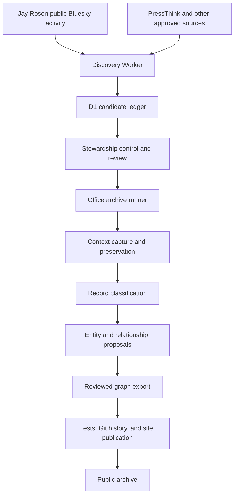
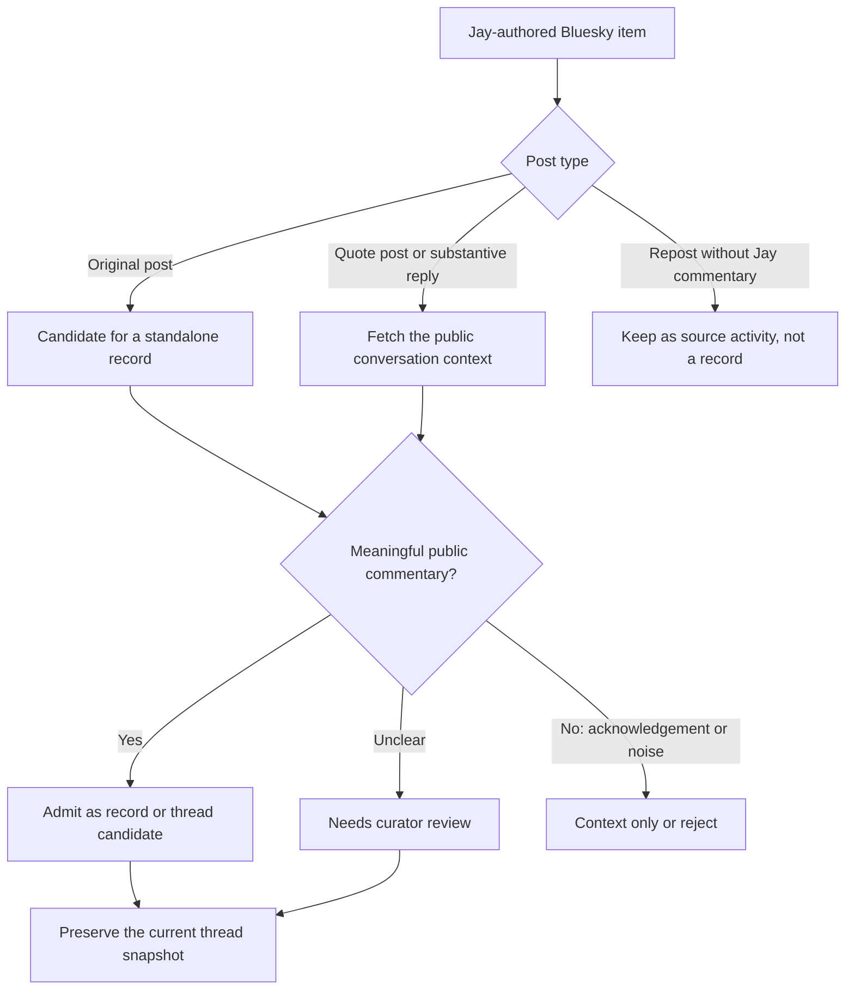
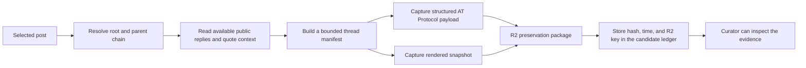
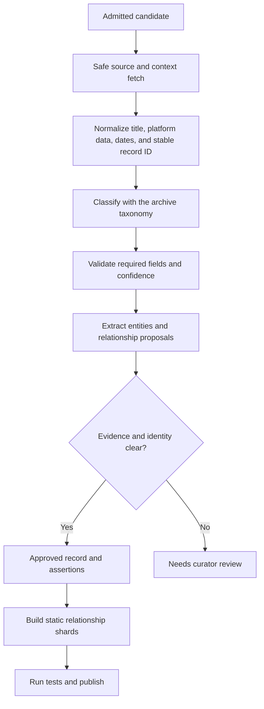

# Bluesky-first archive stewardship pipeline

**Status:** Design and work map. The existing archive publishing path remains the release boundary.

## Purpose

Jay Rosen now publishes most new public work on Bluesky. This pipeline finds that work, preserves its public context, turns worthy material into reviewed archive records, and keeps the entity graph useful.

The system must be useful without turning every brief social interaction into an archive record. It must also keep a clear record of what it saw, when it saw it, and why it made each decision.

## The short version

Two Cloudflare Workers coordinate the work. The existing office pipeline does the expensive and archival work.



Bluesky is the primary source. PressThink is a low-frequency backstop for the occasional new essay or site change.

The Workers are traffic controllers. They do not own the canonical CSV files, source snapshots, model prompts, GitHub credentials, or publication credentials.

## What runs where

| Stage | System | Job | Current position |
|---|---|---|---|
| Find activity | Discovery Worker | Read approved public source feeds and record new identifiers. | Worker pilot exists. It currently needs a Bluesky-first source adapter. |
| Keep a small ledger | D1 | Store source, URI, content ID, times, hashes, and decision state. | Pilot exists. It is not canonical archive data. |
| Decide and dispatch | Stewardship control Worker | Apply safe routing rules and send admitted candidates to the office runner. | Planned. |
| Read text and context | Office archive runner | Use public AT Protocol data, then get the complete available thread context. | Existing social tools provide a starting point. |
| Preserve evidence | Office archive runner plus R2 | Store a time-stamped source payload, manifest, and rendered snapshot. | Planned. |
| Create an archive record | Existing archive processor | Apply taxonomy, stable IDs, review flags, and source rules. | Existing. |
| Extract entities | Existing archive processor | Produce schema-checked entity and relationship proposals. | Existing. |
| Publish graph data | Offline exporter | Build approved public relationship shards. | In progress in issue #807. |
| Release | Existing GitHub and FTPS path | Run tests, preserve Git history, and publish only after success. | Existing. |

## The source policy

The discovery Worker should resolve Jay's account to a stable Bluesky DID. A handle can change. A DID is the stable account identity.

It should use public AT Protocol endpoints. It should not use a browser session, copied cookies, or an arbitrary web-page scraper.

The Worker records only compact discovery data:

- Jay's DID and the post URI.
- The content ID and publication time.
- Whether the item is an original post, reply, quote post, repost, or thread entry.
- Parent and root identifiers where the source provides them.
- A content fingerprint and the discovery run identifier.

The Worker does not store the full conversation or create archive records. It never publishes an item.

## What becomes an archive candidate

Every Jay-authored original post, reply, and quote post can enter the candidate ledger. The next stage decides whether it is archive material.



A meaningful item usually makes an argument, gives evidence, asks a serious question, adds analysis, responds to another thinker, or contributes to a public discussion about journalism, media, democracy, or related work.

Post length alone is not enough. A short reply can be meaningful. A long item can still be a repost or noise.

Short acknowledgements such as “yes,” “agreed,” or “sounds good” do not become their own archive records. They can remain inside a saved thread snapshot when they provide context for a meaningful exchange.

## Conversation and snapshot preservation

A substantive reply does not make sense without its context. The office runner must capture the public conversation state before it writes an archive candidate.



The manifest records the capture time, selected post, root post, public post identifiers, visible media references, request method, and content hashes. It also records any replies that were unavailable, deleted, blocked, or outside a set size limit.

SingleFile is a proposed rendered-snapshot tool. It belongs in the controlled office runner, not in the edge Worker. It can save the visible page structure, CSS, and available image references at the capture time. The preservation package must also include a structured source payload and manifest. A rendered HTML file alone is not enough for trustworthy archival replay.

Raw snapshots are preservation evidence. They are not automatically public archive content. The public site only receives material that passes the archive's review and rights rules.

## Processing and graph work

After a candidate is admitted, the existing archive processor does the durable work.



Entity extraction produces proposals, not truth. The system matches a proposed entity to a known canonical entity only when its name, type, aliases, and evidence support the match. It sends conflicts and uncertain aliases to a curator.

Relationship mapping has two outputs:

- A record-to-entity connection with provenance, confidence, type, direction, and review state.
- A public-safe, static relationship shard for the archive interface.

No Worker infers a relationship during a reader request. The public relationship export is built offline, tested, and released with the archive data.

## Fallbacks and escalation

The system uses a safe waterfall. It does not try to defeat source restrictions.

| Problem | First response | Next response | Stop or escalation |
|---|---|---|---|
| Unchanged source | Record a healthy no-change run. | None. | No alert. |
| Temporary network or server error | Retry with bounded backoff. | Retry in the next scheduled run. | Alert after the agreed failure limit. |
| Bluesky API shape changes | Reject the payload against its schema. | Preserve the error class and pause that source adapter. | Send an operator task. |
| Missing thread context | Use the available public root and parent chain. | Mark missing context in the manifest. | Curator decides whether the item can stand alone. |
| Meaning is unclear | Use deterministic signals and a schema-checked classifier. | Send the candidate to curator review. | Do not auto-publish. |
| Entity alias or relationship is uncertain | Keep the proposal and evidence separate. | Use approved aliases and a reviewer. | Do not merge the entity automatically. |
| `401`, `403`, `429`, login wall, CAPTCHA, paywall, or robots restriction | Record `policy_blocked`. | Use an official public API or source-provided export only. | Do not bypass the restriction. |
| Test, Git, or FTPS failure | Stop before publication. | Retry only the failed safe stage. | Keep the item in a truthful non-live state. |

The escalation sequence is always the same: deterministic rule, permitted source method, bounded retry, review queue, then a human decision. A technical denial is a stop signal, not a reason to use a more aggressive scraper.

## Target decision states

The initial D1 pilot uses a small set of review states. The complete control plane should make the full path visible:

```text
discovered
  -> context_needed
  -> needs_review
  -> admitted
  -> preserved
  -> processed
  -> review_required
  -> published

discovered | needs_review -> rejected_noise (terminal)
discovered | context_needed -> policy_blocked (terminal)
processed -> rejected (terminal)
```

Each state change needs a time, rule or operator, reason, and link to the evidence package. A Worker outage can delay discovery. It cannot corrupt the canonical archive because the canonical data remains in the existing repository workflow.

## Build order

1. Change issue #806 from a PressThink-led pilot to Bluesky-first public discovery.
2. Add the Bluesky DID source adapter and deterministic candidate types.
3. Add the candidate handoff to the office archive runner.
4. Add bounded thread-context capture and the preservation manifest.
5. Add the meaningful-discourse review policy.
6. Extend social record processing, entities, and relationship export.
7. Add run health, retry, escalation, and recovery reporting.

Cloudflare remains an additive control plane until the archive has an owner-transfer and retirement plan. The existing repository, tests, and publication workflow remain the canonical release boundary.

## Related work

- #806 — Bluesky-first discovery ledger.
- #725 — social-post audit and enrichment.
- #807 — public-safe relationship adjacency shards.
- #738 — graph quality and coverage.
- #743 — health, alerting, and runbook notifications.
