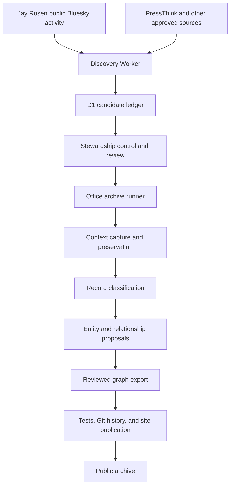
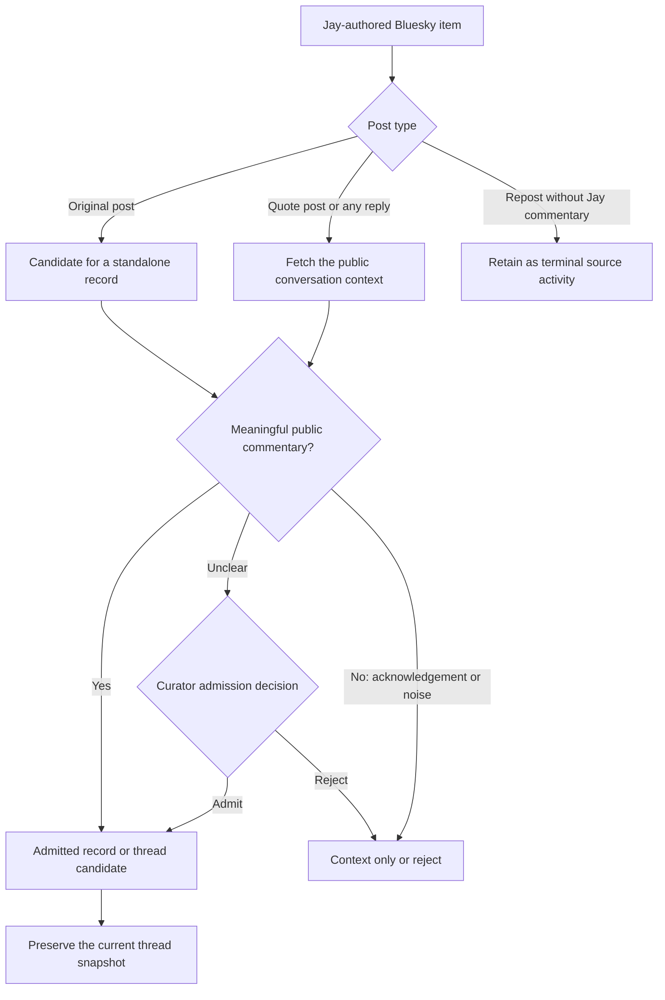
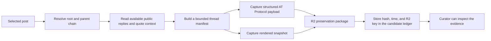
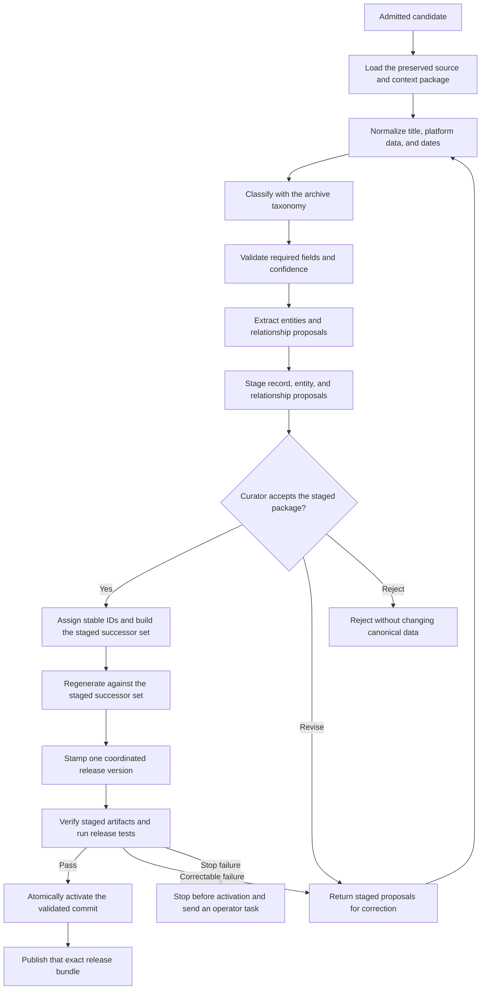

# Bluesky-first archive stewardship pipeline

**Status:** Design and work map. The existing archive publishing path remains the release boundary.

## Purpose

Jay Rosen now publishes most new public work on Bluesky. This pipeline finds that work, preserves its public context, turns worthy material into reviewed archive records, and keeps the entity graph useful.

The system must be useful without turning every brief social interaction into an archive record. It must also keep a clear record of what it saw, when it saw it, and why it made each decision.

## The short version

Two Cloudflare Workers coordinate the work. The existing office pipeline does the expensive and archival work.



Bluesky is the primary source. PressThink is a low-frequency backstop for the occasional new essay or site change.

The Workers are traffic controllers. They do not own the canonical CSV files, source snapshots, model prompts, GitHub credentials, or publication credentials.

## What runs where

| Stage | System | Job | Current position |
|---|---|---|---|
| Find activity | Discovery Worker | Read approved public source feeds and record new identifiers. | Worker pilot exists. It currently needs a Bluesky-first source adapter. |
| Keep a small ledger | D1 | Store source, URI, content ID, times, hashes, decision state, and the exact Jay-authored source record observed at discovery. | Pilot exists. It is not canonical archive data. |
| Decide and dispatch | Stewardship control Worker | Send candidates that need content or conversation evidence to the office runner, then apply safe admission rules to the returned evidence. | Planned. |
| Read text and context | Office archive runner | Use public AT Protocol data, then get deterministic bounded thread context. | Existing social tools provide a starting point. |
| Preserve evidence | Office archive runner plus R2 | Store a time-stamped source payload, manifest, and rendered snapshot. | Planned. |
| Create an archive record | Staged archive processor | Apply taxonomy and source rules before stable IDs or canonical writes. | Planned. It requires a staged-entry refactor around the existing processor. |
| Extract entities | Social-record processing extension | Produce schema-checked entity and relationship proposals from a post or bounded thread context. | Planned. The existing processor skips text shorter than 500 characters. |
| Publish graph data | Offline exporter | Build approved public relationship shards. | In progress in issue #807. |
| Release | Existing GitHub and SFTP/FTPS path | Run tests, preserve Git history, and publish only after success. | File-atomic publication exists; bundle activation and recovery are planned. |

## The source policy

The discovery Worker should resolve Jay's account to a stable Bluesky DID. A handle can change. A DID is the stable account identity.

It should use public AT Protocol endpoints. It should not use a browser session, copied cookies, or an arbitrary web-page scraper.

The Worker records compact discovery data:

- Jay's DID and the post URI.
- The content ID and publication time.
- Whether the item is an original post, reply, quote post, repost, or thread entry.
- Parent and root identifiers where the source provides them.
- A content fingerprint and the discovery run identifier.
- The exact public AT Protocol record for Jay's post as it appeared at discovery, including attached-media references and metadata but not the referenced blob bytes.

The observed source record is immutable evidence of the text, metadata, and blob references visible at discovery. It protects those fields against an edit or deletion between discovery and the office-runner handoff, but it does not guarantee recovery of attached media bytes. The office runner fetches permitted public blobs when it builds the preservation package and records any media already unavailable at capture time. The Worker does not store the full conversation or create archive records. It never publishes an item.

## What becomes an archive candidate

Every Jay-authored original post, reply, and quote post can enter the candidate ledger. The next stage decides whether it is archive material.



A meaningful item usually makes an argument, gives evidence, asks a serious question, adds analysis, responds to another thinker, or contributes to a public discussion about journalism, media, democracy, or related work.

Post length alone is not enough. A short reply can be meaningful. A long item can still be a repost or noise.

Short acknowledgements such as “yes,” “agreed,” or “sounds good” do not become their own archive records. They can remain inside a saved thread snapshot when they provide context for a meaningful exchange.

## Conversation and snapshot preservation

A substantive reply does not make sense without its context. The office runner must capture the public conversation state before it writes an archive candidate.



The manifest must conform to [`preservation/preservation-manifest.schema.json`](../preservation/preservation-manifest.schema.json) and pass [`preservation/validate-preservation-manifests.mjs`](../preservation/validate-preservation-manifests.mjs). It represents the selected post, root post, retrieved public posts, and rendered capture with the schema's versioned object, event, artifact, actor, review, storage-copy, and append-only supersession contracts. Capture time, public post identifiers, visible media references, request method, content hashes, and unavailable, deleted, blocked, or size-limited replies belong inside those existing contracts. New vocabulary requires a versioned schema migration instead of an ad hoc thread manifest.

Thread capture is deterministic and bounded. The initial policy always prioritizes the selected post, root, and available parent or quoted-post chain, up to 64 chain entries. It then traverses public replies breadth-first, ordering each depth by creation time and URI, and stops at the first of depth 4, 500 total retrieved posts, 5 MiB of decoded AT Protocol JSON, or 20 source pages where an endpoint paginates. The manifest records the policy version, requested and returned counts, limits reached, last cursor when available, and omitted count when the source reports one. A truncated capture remains reviewable evidence; it is never described as the complete conversation.

SingleFile is a proposed rendered-snapshot tool. It belongs in the controlled office runner, not in the edge Worker. It can save the visible page structure, CSS, and available image references at the capture time. The preservation package must also include a structured source payload and manifest. A rendered HTML file alone is not enough for trustworthy archival replay.

Raw snapshots are preservation evidence. They are not automatically public archive content. The public site only receives material that passes the archive's review and rights rules.

## Processing and graph work

After a candidate is admitted, a staging path does the durable preparation work. It does not write canonical records or graph rows until a curator accepts the staged package.



Entity extraction produces proposals, not truth. The system stores proposed records, entities, relationships, aliases, and evidence outside the canonical CSV files. It matches a proposed entity to a known canonical entity only when its name, type, aliases, and evidence support the match. A curator must accept that evidence before the system calls the canonical CSV writer, assigns a new canonical ID, or reuses an existing one.

The [current submission processor](../backend/scripts/process_submission.py) is not this staging boundary. Its [runtime configuration](../backend/submission_runtime/config.py) targets `data/archive_records-public.csv`, the Bluesky processor does not supply a `BSKY-*` source ID, it skips entity extraction for text shorter than 500 characters, and its `needs_review` flag does not stop tests and deployment. An accepted Bluesky package therefore needs a dedicated social release adapter. That adapter must follow the [social record contract](../ADDING-RECORDS.md), allocate or reuse a `BSKY-*` ID only after acceptance, and build successor copies of every touched canonical file in an isolated staging worktree. It runs [`data/export-archive-data.js`](../data/export-archive-data.js) against that complete staged set and verifies that the generated JSON contains the accepted record and relationships. It then runs `npm run bump-version -- X.X.X` so `index.html`, `version.json`, every relevant `?v=` import, and [`frontend/sw.js`](../frontend/sw.js) `CACHE_VERSION` advance together. The adapter verifies the complete generated and versioned bundle and runs the release tests before it creates and activates the canonical commit. A correctable validation failure returns the staged proposals to curator review; it does not alter the canonical head. Before acceptance, the social path must either aggregate bounded thread context or use a reviewed short-text extraction rule; it must not hand the package unchanged to the current article-record processor.

An accepted standalone reply or quote post must also have a curator-approved, non-generic title and a rights-cleared summary of the parent or quoted context in [`data/authored-excerpts.csv`](../data/authored-excerpts.csv). The adapter verifies that the item survives the exporter's short-generic-reply filter where applicable and that the public JSON includes the context summary. If required parent or quoted material cannot be summarized under the rights rules, the item remains only in its preservation package or ships inside an approved public thread; it does not publish as a context-free standalone record.

Before it reads canonical files, allocates IDs, or stages successors, the adapter obtains an exclusive canonical-writer lease with a fencing token. The package receipt records that token, the package ID, accepted IDs, touched paths, expected before-and-after hashes, validated commit, and release manifest. Activation atomically verifies the fencing token, expected canonical head, and every expected before-hash before it advances the canonical ref to the validated commit. A mismatch discards the staged successors and restages from the new canonical head. The same lease remains held through bundle publication and final verification, so a later package cannot activate or publish an older view of the archive. A crash or filesystem failure enters `canonical_recovery` or `release_recovery`, keeps later writers fenced out, and uses the receipt to finish or restore the complete canonical and published bundles. The package releases the lease only after it reaches `published` or recovery restores the prior canonical and live release.

The current FTPS scripts activate files one at a time, so a mid-upload failure can expose a mixed release. Automated publication for this pipeline needs a bundle-level activation step, such as a versioned release directory and one final pointer switch. Until that exists, a partial upload enters `release_recovery`, blocks later releases, and uses the previous and intended bundle manifests to finish the upload or restore the last known-good bundle before the candidate becomes `published`.

Relationship mapping separates mentions from entity-to-entity relationships:

- Staged proposals retain the evidence post URI and author DID along with provenance, confidence, type, direction, and review state. Context from another author never inherits Jay's accepted `record_id` merely because it was captured in the same thread.
- Accepted mention edges write to a planned, versioned `data/record_entity_edges.csv` sidecar with `record_id`, `entity_id`, mention role, evidence text, confidence, and review receipt. Both IDs must resolve to accepted canonical rows, and the evidence must occur in Jay's accepted post or its rights-cleared public context summary.
- Accepted entity-to-entity edges map losslessly to [`data/extracted_relationships.csv`](../data/extracted_relationships.csv), where `source_record_id` is provenance and both endpoints resolve to [`data/extracted_entities.csv`](../data/extracted_entities.csv). The cited evidence must occur in Jay's accepted post or its rights-cleared public context summary. Evidence found only in a third party's non-public context stays in the preservation package and cannot create a public record edge. A proposal that cannot make that mapping stays staged until a versioned schema extension exists.
- The exporter must read the mention sidecar and add every accepted entity to its public record, including singleton mentions with no entity-to-entity edge. It also derives connections from accepted entity-to-entity rows and builds the public-safe static relationship shard.

No Worker infers a relationship during a reader request. The public relationship export is built offline, tested, and released with the archive data.

## Fallbacks and escalation

The system uses a safe waterfall. It does not try to defeat source restrictions.

| Problem | First response | Next response | Stop or escalation |
|---|---|---|---|
| Unchanged source | Record a healthy no-change run. | None. | No alert. |
| Temporary network, server, or `429` rate-limit response | Retry with bounded backoff and honor `Retry-After` when present. | Retry in the next scheduled run. | Alert after the agreed failure limit. |
| Bluesky API shape changes | Reject the payload against its schema. | Preserve the error class and pause that source adapter. | Send an operator task. |
| Missing thread context | Use the available public root and parent chain. | Mark missing context in the manifest. | Curator decides whether the item can stand alone. |
| Meaning is unclear | Use deterministic signals and a schema-checked classifier. | Send the candidate to curator review. | Do not auto-publish. |
| Entity alias or relationship is uncertain | Keep the proposal and evidence separate. | Use approved aliases and a reviewer. | Do not merge the entity automatically. |
| `401` or an unexpected authentication challenge on a nominally public endpoint | Pause the adapter in an operator-attention state. | Check the endpoint, credentials, and proxy configuration. | Retry after the operational fault is corrected; do not record `policy_blocked` without a confirmed access restriction. |
| Confirmed `403`, login wall, CAPTCHA, paywall, or robots restriction | Record `policy_blocked`. | Use an official public API or source-provided export only. | Do not bypass the restriction. |
| Canonical package write fails before commit | Enter `canonical_recovery` and stop later packages. | Use the package receipt and file hashes to finish or restore the full canonical set. | Do not regenerate, test, commit, or publish a partial package. |
| Test or Git failure before upload | Stop before publication. | Retry only the failed safe stage. | Keep the item in a truthful non-live state. |
| FTPS failure before bundle activation | Keep the prior bundle active. | Retry and verify the staged bundle. | Do not activate an incomplete release. |
| FTPS failure after any live file changes | Enter `release_recovery` and stop later releases. | Reconcile the intended and previous bundle manifests. | Finish or restore one complete bundle before marking the item published. |

The escalation sequence is always the same: deterministic rule, permitted source method, bounded retry, review queue, then a human decision. A technical denial is a stop signal, not a reason to use a more aggressive scraper.

## Target decision states

The initial D1 pilot uses a small set of review states. The complete control plane should make the full path visible:

```text
discovered
  -> context_needed
  -> needs_review
  -> admitted
  -> preserved
  -> processed
  -> review_required
  -> accepted
  -> release_validated
  -> activated
  -> publishing
  -> published

discovered -> needs_review
discovered -> admitted
discovered | context_needed | needs_review -> retained_source (terminal)
context_needed -> admitted
discovered | context_needed | needs_review -> rejected_noise (terminal)
discovered | context_needed -> policy_blocked (terminal)
review_required | accepted -> revision_requested -> processed
review_required -> rejected (terminal)
release_validated -> canonical_recovery -> activated | accepted
activated | publishing -> release_recovery -> published | activated
```

The admission decision uses the evidence already returned by the permitted discovery and context fetch. Processing after admission reads the immutable preserved package instead of fetching the source again, so an access-policy failure is resolved before the candidate enters the admitted path. A revision changes only staged proposals, records the curator's reason, and loops through validation and `review_required` again; it never mutates canonical rows in place.

Each state change needs a time, rule or operator, reason, and link to the evidence package. A Worker outage can delay discovery. It cannot corrupt the canonical archive because the canonical data remains in the existing repository workflow.

## Build order

1. Change issue #806 from a PressThink-led pilot to Bluesky-first public discovery.
2. Add the Bluesky DID source adapter and deterministic candidate types.
3. Add the candidate handoff to the office archive runner.
4. Add bounded thread-context capture and the preservation manifest.
5. Add the meaningful-discourse review policy.
6. Extend social record processing, entities, and relationship export.
7. Add run health, retry, escalation, and recovery reporting.

Cloudflare remains an additive control plane until the archive has an owner-transfer and retirement plan. The existing repository, tests, and publication workflow remain the canonical release boundary.

## Related work

- #806 — Bluesky-first discovery ledger.
- #725 — social-post audit and enrichment.
- #807 — public-safe relationship adjacency shards.
- #738 — graph quality and coverage.
- #743 — health, alerting, and runbook notifications.
